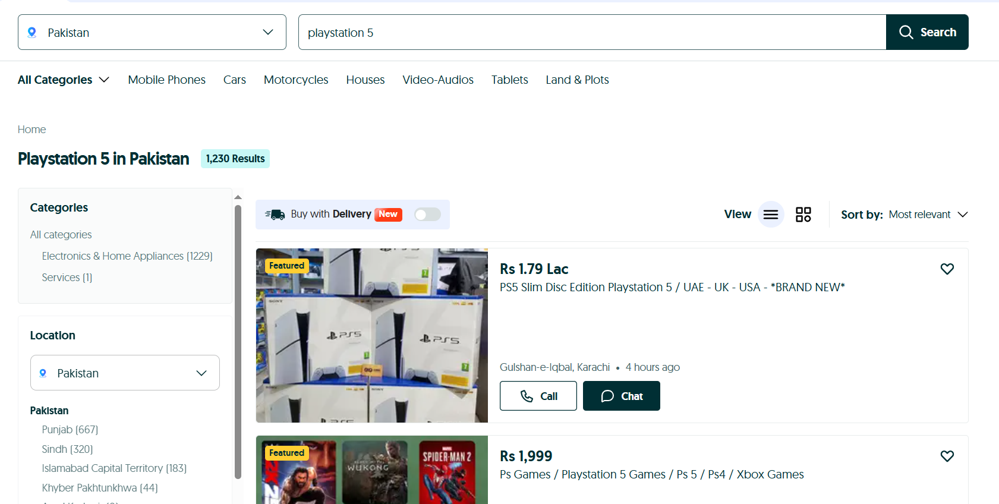
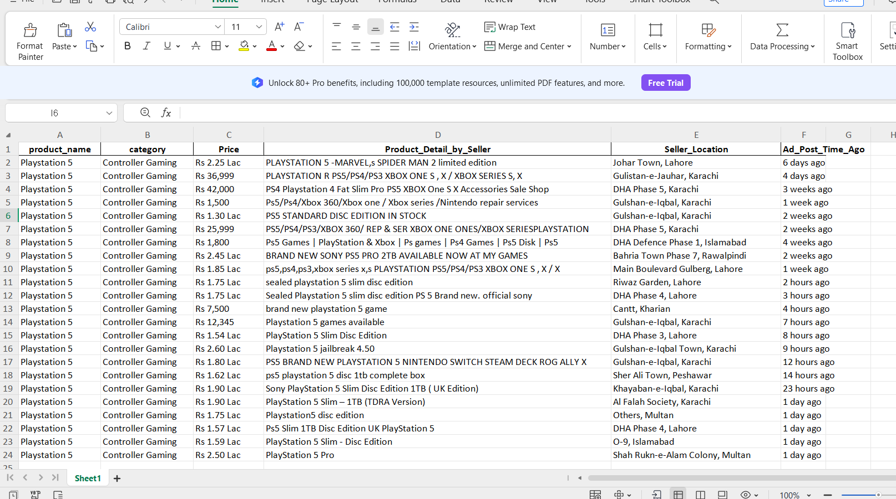

# OLX PS5 Scraper

A Python-based web scraper that extracts PS5 listings from OLX Pakistan.

## Features
- Scrapes product name, category, price, details, location, and post time
- Saves data to a formatted Excel file

## How to Run
1. Install dependencies: `pip install requests beautifulsoup4 pandas openpyxl`
2. Run the script: `python olx_scraper.py`
3. Output will be saved as `OLX_listing_PS5_detail.xlsx`

## The WEB Page I Work With

## Preview

## License
MIT

